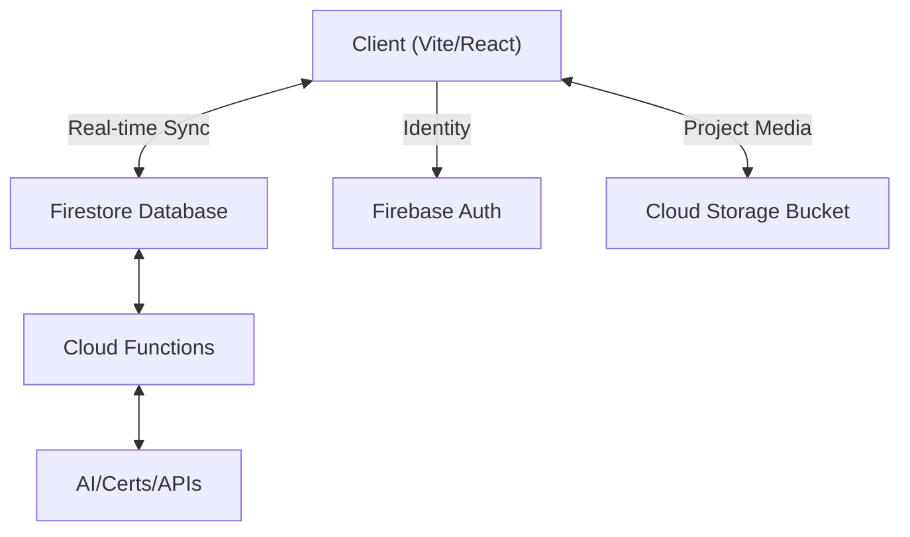

<div align="center">
  <h1>🚀 NXTGENSEC: Hackathon Ecosystem</h1>
  <p><strong>A World-Class, Scalable Hackathon Platform Built for Innovators</strong></p>
</div>

---

## 📖 Overview

**NXTGENSEC** is a comprehensive, scalable hackathon management ecosystem specifically engineered to handle thousands of concurrent users (10,000+ targeted). Built with modern web technologies, it features a unified **"Premium Glassmorphic Cyber"** design system that provides an immersive experience for Participants, Mentors, Judges, and Organizers alike.

---

## ✨ Core Features

*   **Role-Based Access:** Specialized dashboards and features for Participants, Mentors, Judges, Organizers, and Admins.
*   **Real-time Collaboration:** Designed for team formation, real-time tracking, chat, and live leaderboards.
*   **Integrated Firebase Backend:** Ready for secure authentication, real-time database syncing with Firestore, and backend logic with Cloud Functions.
*   **Immersive UI/UX:** Built with React, Vite, and an interactive 3D backdrop (Three.js), utilizing a highly-polished Glassmorphic Cyber aesthetic.
*   **AI Integration Ready:** Planned features include an AI teammate matchmaking system, automated scoring evaluations, and a dual-mode chatbot (Static FAQ + Dynamic LLM).

---

## 🏗️ System Architecture

NXTGENSEC follows a modern, scalable, serverless architecture.



### 📂 Folder Structure
The codebase follows a scalable, modular architecture:
```text
src/
├── assets/          # Static media (images, global icons)
├── components/      # Reusable React components
│   ├── layout/      # App-wide shells (Navbar, Footer, Layout)
│   ├── ui/          # Atomic components (Logo, Button)
│   ├── features/    # Complex widgets (Chatbot, HyperspeedBackground)
│   └── utils/       # Wrappers (ScrollReveal, ProtectedRoute)
├── context/         # Global state management (AuthContext)
├── data/            # Local static data or constant maps
├── hooks/           # Custom React hooks (e.g., useAuth)
├── pages/           # Route-level views
│   ├── auth/        # Login, registration, profile views
│   ├── dashboard/   # Authenticated control panels (Admin, Judge, User)
│   ├── event/       # Hackathon specifics (Gallery, Leaderboard, Teams)
│   ├── support/     # Info pages (Docs, Guides, Mentors)
│   ├── legal/       # Compliance (Privacy, Terms, Conduct)
│   └── Home.jsx     # Landing page
├── services/        # External APIs and SDKs (Firebase)
├── styles/          # Global CSS and theming
├── utils/           # Helper functions and formatters
├── App.jsx          # Router and provider entry
└── main.jsx         # React DOM mount point
```

### Frontend Stack
*   **Vite + React 18**: Chosen for ultra-fast Hot Module Replacement (HMR) and optimized build times.
*   **Vanilla CSS**: Custom "Premium Glassmorphic Cyber" utility set for maximum styling control with zero bloat.
*   **Icons**: `lucide-react` for crisp, consistent vector iconography.
*   **Routing**: `react-router-dom` for seamless Single Page Application (SPA) navigation.

### Backend Stack (Firebase Ecosystem)
*   **Authentication**: Firebase Auth (Google/Email support).
*   **Database**: Firestore (NoSQL) configured for real-time data sync.
*   **Storage**: Firebase Cloud Storage for handling user avatars, project assets, and submission uploads.
*   **Cloud Functions**: Node.js APIs for trusted backend logic, including the AI chatbot requests and automated PDF certificate generation.

---

## 🗄️ Database Design (Firestore)

The platform utilizes a document-based NoSQL schema optimized for fast, real-time querying.

*   **`users`**: Profiles containing `uid`, `displayName`, `email`, `skills[]`, `role` (Participant, Mentor, Judge, Admin), and `teamId`.
*   **`hackathons`**: Event instances structured with `title`, `description`, `status` (upcoming/active/closed), and timing metadata.
*   **`teams`**: Formed groups pointing to a list of `members (uids)` and a submitted `projectId`.
*   **`submissions`**: Finalized projects including repository links (`githubUrl`), live demos (`demoUrl`), and sub-collections for Judge `scores`.
*   **`chats`**: Real-time communication structures holding arrays of messages mapped per session or team.

---

## 🚀 Getting Started

### Prerequisites

Ensure you have the following installed to run the platform locally:
*   [Node.js](https://nodejs.org/en/) (v18.0.0 or higher)
*   npm or yarn package manager

### Installation

1.  **Clone / Prepare Directory**
    Ensure you are inside the `NEXTGENSEC` root directory.

2.  **Install Dependencies**
    ```bash
    npm install
    ```

3.  **Run Development Server**
    Start up the Vite dev server with Hot Module Replacement (HMR).
    ```bash
    npm run dev
    ```

4.  **Production Build**
    Create minified, optimized static assets in the `/dist` directory.
    ```bash
    npm run build
    ```

---

## 🔮 Roadmap / Future Enhancements

*   **Phase 1**: Frontend refactoring & mock integrations (Current)
*   **Phase 2**: Live Firebase integration (Auth & Firestore)
*   **Phase 3**: AI Teammate Matcher logic deployment via Cloud Functions
*   **Phase 4**: Blockchain-based Credentialing & Dynamic NFTs for certificates
*   **Phase 5**: Global hackathon aggregator expansion

---

*For detailed project specifications, design prompts, and feature checklists, please refer to `/docs/NXTGENSEC_MASTER_SPEC.md`.*
